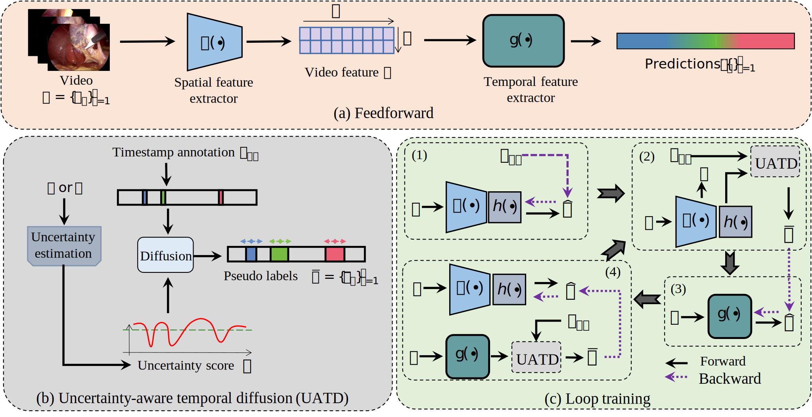

# Less is More: Surgical Phase Recognition from Timestamp Supervision

## Introduction

This is a PyTorch implementation of [Less is More: Surgical Phase Recognition from Timestamp Supervision].

In this paper, we introduce a new setting, i.e., Timestamp supervision, for surgical phase recognition

Framework visualization



## Preparation

## Data Preparation

* We use the dataset [Cholec80](http://camma.u-strasbg.fr/datasets) and [M2CAI 2016 Challenge](http://camma.u-strasbg.fr/m2cai2016/index.php/program-challenge/).
* Training and test data split

  Cholec80: first 40 videos for training and the rest 40 videos for testing.

  M2CAI: 27 videos for training and 14 videos for testing.
* Data Preprocessing:

1. Using [FFmpeg](https://www.ffmpeg.org/download.html) to convert the videos to frames;
2. Downsample 25fps to 1fps (Or can directly set the convert frequency number as 1 fps in the previous step);
3. Cut the black margin existed in the frame using the function of ``change_size()`` in ``video2frame_cutmargin.py``;
4. Resize original frame to the resolution of 250 * 250.

* The structure of data folder is arranged as follows:

```

(root folder)

├── data

|  ├── cholec80

|  |  ├── cutMargin

|  |  |  ├── 1

|  |  |  ├── 2

|  |  |  ├── 3

|  |  |  ├── ......

|  |  |  ├── 80

|  |  ├── phase_annotations

|  |  |  ├── video01-phase.txt

|  |  |  ├── ......

|  |  |  ├── video80-phase.txt

├── code

|  ├── ......

```
## Annotation Details
We invite two surgeons to conduct full and timestamp annotations respectively. The details can be found in ``/human_annotation/``.

## Setup & Training

1. Check dependencies:

   ```

    matplotlib==3.5.1
    numpy==1.21.2
    Pillow==9.3.0
    scikit_learn==1.1.3
    scipy==1.7.3
    tabulate==0.9.0
    torch==1.11.0
    torchvision==0.12.0
    tqdm==4.62.3


   ```
2. Conduct loop training:


   ```
   sh circle.sh

   ```


***Evaluate the predcitions***

```shell

    matlab-eval/Main.m (cholec80)

    matlab-eval/Main_m2cai.m (m2cai16)

```

***Citation***
If this code is useful for your research, please consider citing:

```shell
@article{ding2022less,
  title={Less is More: Surgical Phase Recognition from Timestamp Supervision},
  author={Ding, Xinpeng and Yan, Xinjian and Wang, Zixun and Zhao, Wei and Zhuang, Jian and Xu, Xiaowei and Li, Xiaomeng},
  journal={IEEE TMI},
  year={2022}
}

```
